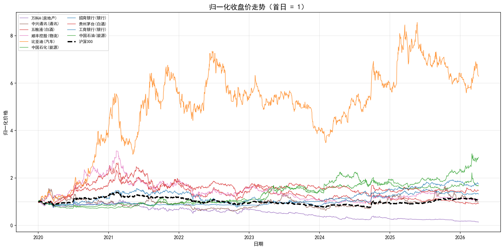
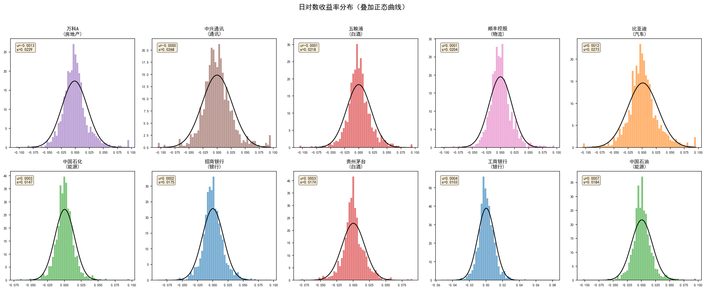
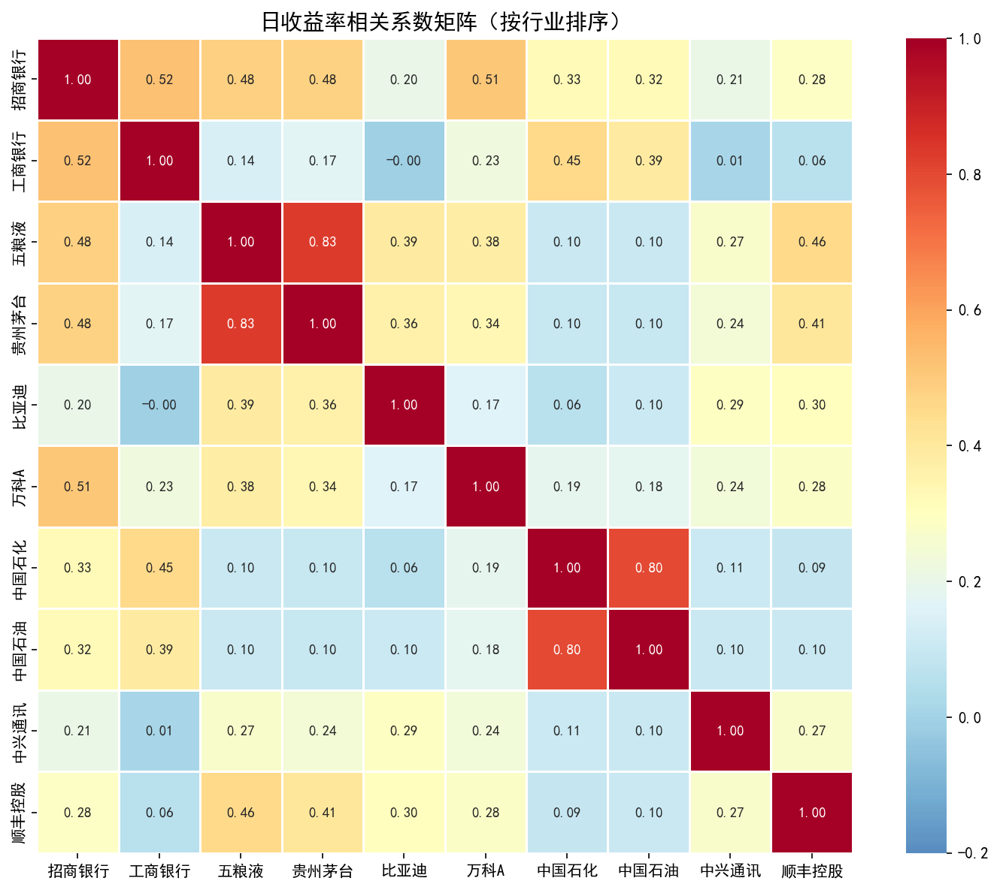
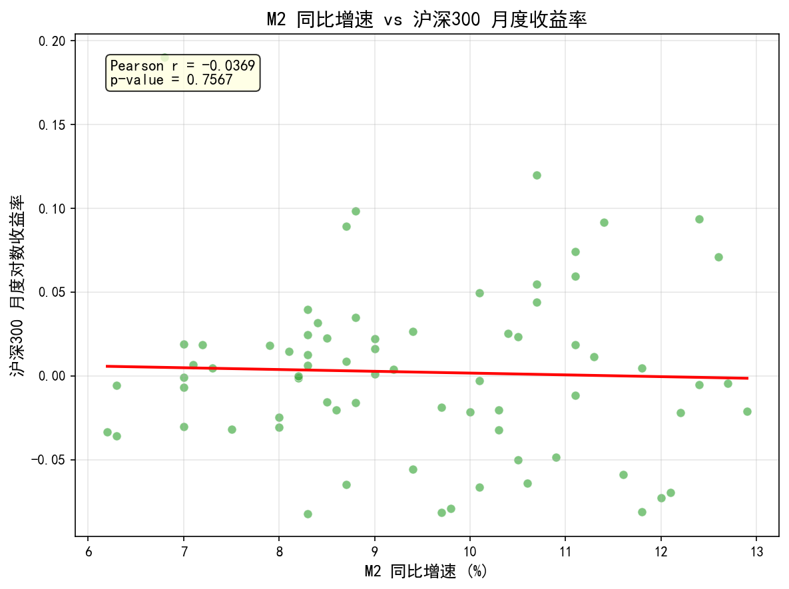
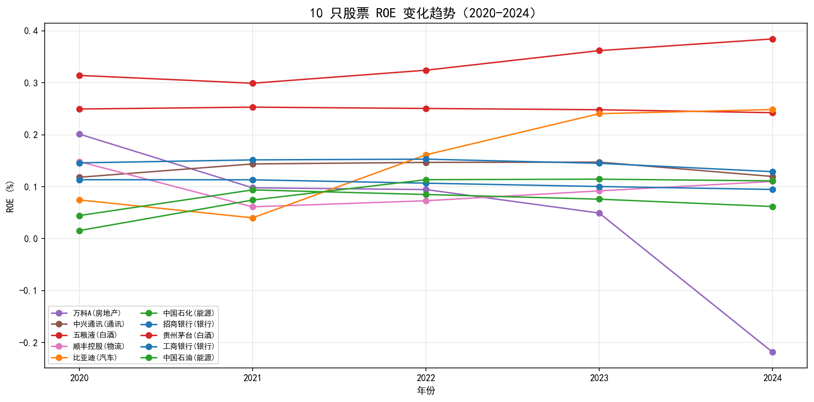
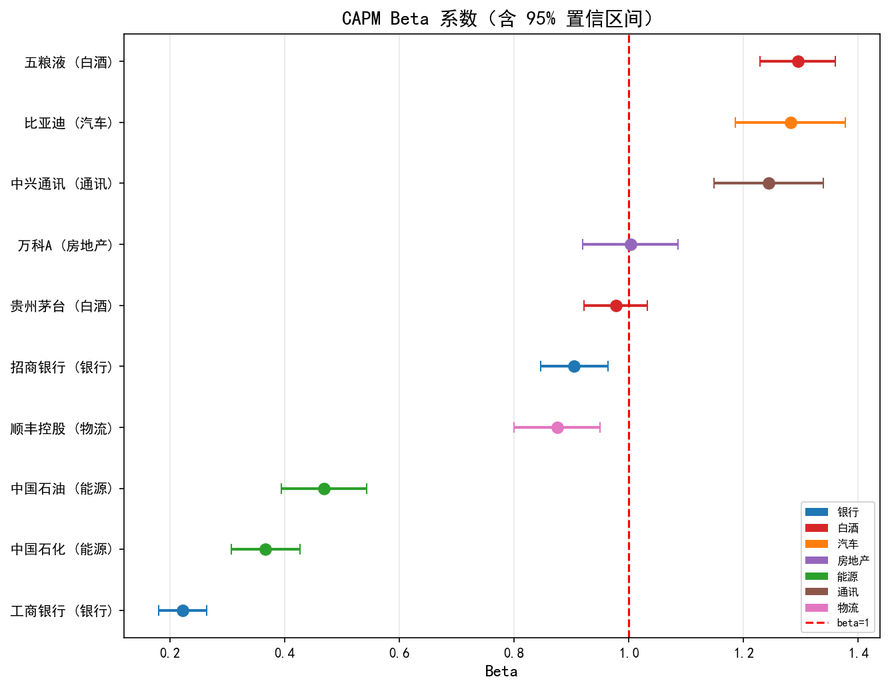

## 描述性统计

计算 10 只股票日对数收益率（$r_t = \ln(P_t / P_{t-1})$）的描述性统计量：

| 股票 | 行业 | 年化均值 | 年化波动率 | 偏度 | 峰度 | 最大回撤 |
|------|------|---------|----------|------|------|---------|
| 比亚迪 | 汽车 | 0.3060 | 0.4330 | 0.30 | 2.09 | -52.54% |
| 中国石油 | 能源 | 0.1754 | 0.2927 | 0.22 | 5.17 | -32.47% |
| 工商银行 | 银行 | 0.0924 | 0.1628 | 0.46 | 5.82 | -20.20% |
| 中国石化 | 能源 | 0.0860 | 0.2335 | 0.36 | 5.37 | -25.06% |
| 贵州茅台 | 白酒 | 0.0642 | 0.2770 | 0.26 | 3.61 | -47.48% |
| 招商银行 | 银行 | 0.0468 | 0.2773 | 0.26 | 3.15 | -50.94% |
| 顺丰控股 | 物流 | 0.0158 | 0.3243 | 0.38 | 3.55 | -70.77% |
| 五粮液 | 白酒 | -0.0136 | 0.3454 | 0.09 | 3.32 | -66.09% |
| 中兴通讯 | 通讯 | -0.0019 | 0.4260 | 0.31 | 2.49 | -61.87% |
| 万科A | 房地产 | -0.3243 | 0.3640 | 0.66 | 3.25 | -86.73% |

所有股票均呈尖峰厚尾分布，超额峰度远大于零，正态分布会系统性低估极端风险。工商银行波动率最低（16.3%），最大回撤仅 -20.2%，体现其防御属性。

## 可视化

### 图 1：归一化收盘价走势

以 2020-01-01 = 1 为基准，展示 10 只股票和沪深 300 的归一化收盘价走势。

{width=100%}

**解读**：比亚迪涨幅远超基准，终值约为起始值的 4.5 倍，得益于新能源汽车行业的结构性增长。万科A 持续下跌至起始值的约 13%，反映房地产行业在"三条红线"等政策调控下的系统性困境。银行股走势与沪深 300 最为贴近，波动较小。

### 图 2：日收益率分布

10 只股票收益率分面直方图，每个子图叠加正态分布曲线，并标注均值和标准差。

{width=100%}

**解读**：所有直方图的中心峰度均高于正态曲线，尾部更厚，证实了尖峰厚尾特征的普遍性。基于正态假设的 VaR 模型会低估尾部风险，实务中需考虑 t 分布或历史模拟法。

### 图 3：收益率相关系数热力图

10 只股票日收益率的 Pearson 相关系数矩阵，按行业排序。

{width=100%}

**解读**：同行业股票对（招商银行-工商银行、贵州茅台-五粮液、中国石油-中国石化）的相关系数明显高于跨行业股票对。这一结果支持跨行业分散化配置能有效降低组合的非系统性风险。

### 图 4：宏观指标与股市关系

M2 同比增速与沪深 300 月度收益率的散点图，叠加线性拟合线。

{width=100%}

**解读**：M2 增速与股指月度收益率的同期线性关系较弱。这可能是因为：（1）货币政策传导至股市存在时滞；（2）M2 增速上升往往发生在经济下行期（逆周期宽松），此时股市基本面偏弱，抵消了流动性利好。

### 图 5：ROE 趋势（选做）

10 只股票 2020-2024 年 ROE 折线图，按行业分组。

{width=100%}

**解读**：白酒行业 ROE 持续领先（茅台 > 25%），体现品牌溢价和轻资产模式的盈利优势。银行业 ROE 稳定但缓慢下行，反映利差收窄的压力。万科 ROE 急剧下滑（从 ~20% 降至负值），与房地产行业的整体困境一致。比亚迪 ROE 逐年攀升，验证了其收益表现的基本面支撑。

## CAPM 回归分析

### 模型设定

$$r_{i,t} - r_f = \alpha_i + \beta_i (r_{m,t} - r_f) + \varepsilon_{i,t}$$

- $r_{i,t}$：个股日对数收益率
- $r_{m,t}$：沪深 300 日对数收益率
- $r_f$：无风险利率，年化 2.0%，日频 $r_f^{daily} = 0.02 / 252$
- 样本：1,514 个交易日

### 回归结果

使用 `statsmodels.OLS` 估计：

| 股票 | 行业 | $\hat{\alpha}$ | p 值 | $\hat{\beta}$ | 95% CI | $R^2$ |
|------|------|----------------|------|---------------|--------|-------|
| 五粮液 | 白酒 | -0.000088 | 0.8245 | 1.2945 | [1.23, 1.36] | 0.4985 |
| 贵州茅台 | 白酒 | +0.000210 | 0.5316 | 0.9772 | [0.92, 1.03] | 0.4418 |
| 招商银行 | 银行 | +0.000138 | 0.6968 | 0.9049 | [0.85, 0.96] | 0.3780 |
| 比亚迪 | 汽车 | +0.001180 | 0.0428* | 1.2817 | [1.19, 1.38] | 0.3110 |
| 中兴通讯 | 通讯 | -0.000043 | 0.9398 | 1.2436 | [1.15, 1.34] | 0.3025 |
| 万科A | 房地产 | -0.001331 | 0.0083* | 1.0028 | [0.92, 1.09] | 0.2693 |
| 顺丰控股 | 物流 | +0.000014 | 0.9756 | 0.8751 | [0.80, 0.95] | 0.2584 |
| 中国石油 | 能源 | +0.000633 | 0.1614 | 0.4685 | [0.39, 0.54] | 0.0910 |
| 中国石化 | 能源 | +0.000275 | 0.4467 | 0.3668 | [0.31, 0.43] | 0.0876 |
| 工商银行 | 银行 | +0.000295 | 0.2470 | 0.2222 | [0.18, 0.26] | 0.0661 |

### Beta 系数可视化

{width=100%}

### 讨论

**Q1：哪些股票 $\hat{\beta} > 1$？与"周期性 vs 防御性"分类是否吻合？**

四只股票 Beta > 1：五粮液（1.29）、比亚迪（1.28）、中兴通讯（1.24）、万科A（1.00）。它们分别属于白酒、汽车、通讯和房地产行业，均为周期性或成长型行业。六只股票 Beta < 1，其中工商银行（0.22）、中国石化（0.37）、中国石油（0.47）最低，属于银行和能源等经典防御性行业。结果与周期性/防御性框架**高度吻合**。

**Q2：$\hat{\alpha}$ 是否显著异于零？Alpha 显著意味着什么？**

仅两只股票的 Alpha 在 5% 水平下显著：

- **比亚迪**（正 Alpha，p=0.0428）：存在超越 CAPM 预期的正向超额收益，可能来源于新能源汽车行业的结构性增长，这部分收益无法被单一市场因子解释
- **万科A**（负 Alpha，p=0.0083）：存在显著为负的异常收益，反映房地产行业受政策调控的系统性利空

其余 8 只股票 Alpha 不显著，与 CAPM 理论的预期一致。需注意 CAPM 为单因子模型，显著的 Alpha 可能源于遗漏因子（规模、价值等）。

**Q3：$R^2$ 最高和最低的股票分别是哪只？如何解释？**

- **最高**：五粮液（$R^2 = 0.4985$）。近一半的日度波动可由市场因子解释，反映其作为大盘消费蓝筹与市场走势的高度同步性
- **最低**：工商银行（$R^2 = 0.0661$）。仅 6.6% 的波动由市场驱动。工商银行作为超大盘国有银行，其走势主要受银行业特有因子（利率、拨备、资本充足率）影响，而非 A 股整体情绪。其极低的 Beta（0.22）佐证了这一点

## 结论

1. **行业配置是 2020-2026 年收益的主要驱动力**：新能源（比亚迪）大幅跑赢，房地产（万科）大幅跑输
2. **尖峰厚尾分布普遍存在**：VaR 模型不应依赖正态假设
3. **跨行业分散化有效降低非系统性风险**：同行业相关性远高于跨行业
4. **CAPM Beta 与行业特性高度吻合**：周期股 Beta > 1，防御股 Beta < 1
5. **显著 Alpha 信号稀少**：仅比亚迪（+）和万科A（-）存在，可能与遗漏因子有关
